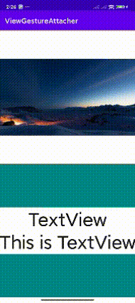

# AndroidGesture

在项目中经常需要用到手势识别，但是安卓SDK带的手势识别总是不尽如人意，所以一般都需要我们自己重新实现一个手势识别器。
AndroidGesture 库就是实现了一些常用的手势识别，同时也从 [PhotoView](https://github.com/Baseflow/PhotoView) 项目中分离出来的一个脱离View的手势控制器。

## GestureDetector

```
GestureDetector detector = new GestureDetector(context, listener);

view.setOnTouchListener((v, e) -> {
    detector.onTouchEvent(v, e);
    return true;
})
```

GestureDetector 支持单指点击，单指双击，单指长按点击（不是长按），双指（三指及以上不支持）拖动，双指缩放，双指旋转。


还支持四个方向的 slide 检测，这个和单指拖动是冲突的

```
detector.setSlideDetectEnable(true)
```

支持单指缩放旋转，需要设置一个锚点，这个操作和单指拖动是冲突的

```
detector.enableSinglePointerScaleRotate(10, 10);
```

```java

public interface GestureListener {
    /**
     * 每个触摸事件开始处理之前的回调
     */
    @CallSuper
    default void onTouchEventBefore(@NonNull MotionEvent e) {
        int action = e.getActionMasked();
        if (action == MotionEvent.ACTION_DOWN) {
            onTouchBeg(e);
        }
    }

    /**
     * 每个触摸事件处理结束之后的回调
     */
    @CallSuper
    default void onTouchEventAfter(@NonNull MotionEvent e) {
        int action = e.getActionMasked();
        if (action == MotionEvent.ACTION_CANCEL || action == MotionEvent.ACTION_UP) {
            onTouchEnd(e);
        }
    }

    /**
     * 最开始的事件
     */
    default void onTouchBeg(@NonNull MotionEvent e) {}

    /**
     * 点击
     */
    default void onClick(float x, float y) {}

    /**
     * 双击
     */
    default void onDoubleClick(float x, float y) {}

    /**
     * 长按点击，这个和长按不一样，长按是不抬起在也会触发，这个是长按后需要抬起才会触发
     */
    default void onLongClick(float x, float y) {}

    /**
     * 左滑，右滑，上滑，下滑，检测，只会存在一个为 true 的情况
     * 要检测滑动动作，需要调用 setSlideDetectEnable(true)
     */
    default void onSlide(boolean left, boolean up, boolean right, boolean down) {}

    /**
     * 开始拖动
     * @param x0 当前Pointer0的触摸坐标x
     * @param y0 当前Pointer0的触摸坐标y
     * @param x1 当前Pointer1的触摸坐标x，如果是 singlePointer, 则等于 x0
     * @param y1 当前Pointer1的触摸坐标y，如果是 singlePointer, 则等于 y0
     */
    default void onDragStart(float x0, float y0, float x1, float y1, boolean singlePointer) {}

    /**
     * 拖动
     * @param x, y 当前 x,y
     * @param dx 拖动的变化值
     * @param dy 拖动的变化值
     * @param sumDx 总的x拖动距离
     * @param sumDy 总的y拖动距离
     * @param singlePointer 是否为单指拖动
     */
    default void onDrag(float x, float y, float dx, float dy, float sumDx, float sumDy, boolean singlePointer) {}

    /**
     * 拖动结束
     * @param singlePointer 是否为单指
     * @return true 表示自己处理 fling, false表示没有处理，默认fling
     */
    default boolean onDragEnd(float sumDx, float sumDy, int velocityX, int velocityY, boolean singlePointer) {
        return false;
    }

    /**
     * 拖动结束之后的阻尼滑动
     * @param dx 滑动的变化值
     * @param dy 滑动的变化值
     * @param singlePointer 是否为单指拖动导致的滑动
     * @return 是否自己处理了 fling,return true 不再继续滑动
     */
    default boolean onFling(float dx, float dy, boolean singlePointer) {
        return false;
    }

    /**
     * fling动画结束的回调
     * @param singlePointer 是否为单指
     */
    default void onFlingEnd(boolean singlePointer) {}

    /**
     * 缩放开始
     * @param singlePointer 是否为单指
     */
    default void onScaleStart(boolean singlePointer) {}

    /**
     * 缩放
     * @param cx 缩放的中心点
     * @param cy 缩放的中心的
     * @param deltaScale 缩放系数,相对于上一次的缩放倍数
     * @param singlePointer 是否为单指操作
     */
    default void onScale(float cx, float cy, float deltaScale, boolean singlePointer) {}

    /**
     * 缩放结束
     */
    default void onScaleEnd(float cx, float cy, boolean singlePointer) {}

    /**
     * 开始旋转
     * @param singlePointer 是否为单指
     */
    default void onRotateStart(boolean singlePointer) {}

    /**
     * 旋转
     * @param cx 旋转中心点
     * @param cy 旋转中心的
     * @param deltaDegrees 旋转角度,相当于上一次的角度变化
     * @param singlePointer 是否为单指操作
     */
    default void onRotate(float cx, float cy, float deltaDegrees, boolean singlePointer) {}

    /**
     * 旋转结束
     */
    default void onRotateEnd(boolean singlePointer) {}

    /**
     * 所有触摸都结束
     */
    default void onTouchEnd(@NonNull MotionEvent e) {}
}
```

## ViewGestureAttacher

ViewGestureAttacher 主要依赖两个参数，一个是本身view的大小，一个是内容的大小， 然后根据手势操作， 
输出一个Matrix，通过 Matrix 可以获取当前内容区域在view中的位置，以及当前内容区域的大小。
ViewGestureAttacher 不支持旋转

通过 ViewGestureAttacher 实现的两个控件 GestureImageView 和 GestureFrameLayout



## GestureImageView

和 PhotoView 一样

## GestureFrameLayout

```
GestureFrameLayout frameLayout = findViewById(R.id.gesture_frame_layout);
TextView textView = findViewById(R.id.gesture_control_view);

frameLayout.addControlView(textView);

textView.post(() -> {
    int width = textView.getWidth();
    int height = textView.getHeight();
    frameLayout.startControl(width, height);
});
```